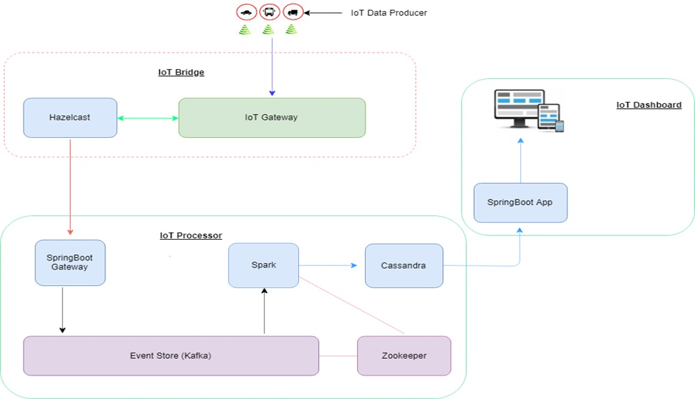

# Openhack with OpenShift.
A hackathon using OpenShift environment which was around IOT. Below are the objectives for the hackathon.

* An IoT connected asset will provide the details about the type, threshold temp, current temp, light, humidity, etc.
* An IoT connected vehicle provides real time information of the vehicle like speed, fuel level, route name, latitude and longitude of vehicle etc.
* The asset information can be analyzed and data can be extracted and transformed to the final result which can be sent back to the vehicle or to a monitoring dashboard. If the threshold temp is reached the coolants in the vehicle can be triggered automatically.
* Also, using the information collected for different vehicles we can analyze and monitor the traffic on a particular route. We’ll use Apache Spark to analyze and process IoT connected vehicle’s data and send the processed data to a real time traffic monitoring dashboard.
* A real time decision can be made to reroute the vehicle based on the traffic, weather and fuel availability.If there is a deviation from the route, there will be alert to the concerns parties.

## Solution Architecture

### Tech Stack:
* Java 8
* Spring Boot
* Apache Kafka
* Spring Cloud Dataflow
* Apache Spark / Apache Apex
* Apache Geode
* Cassandra
* PostgresSQL
* Google MAP API
* WebSockets
* Open Shift / Azure (Tomcat)

